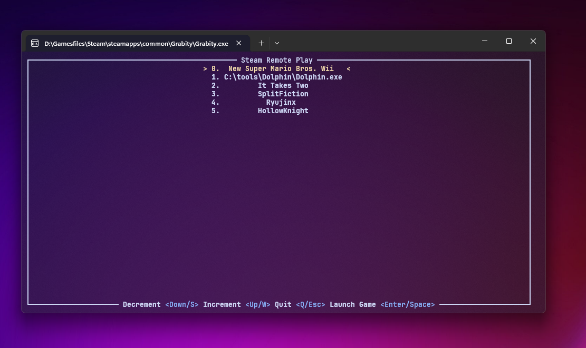
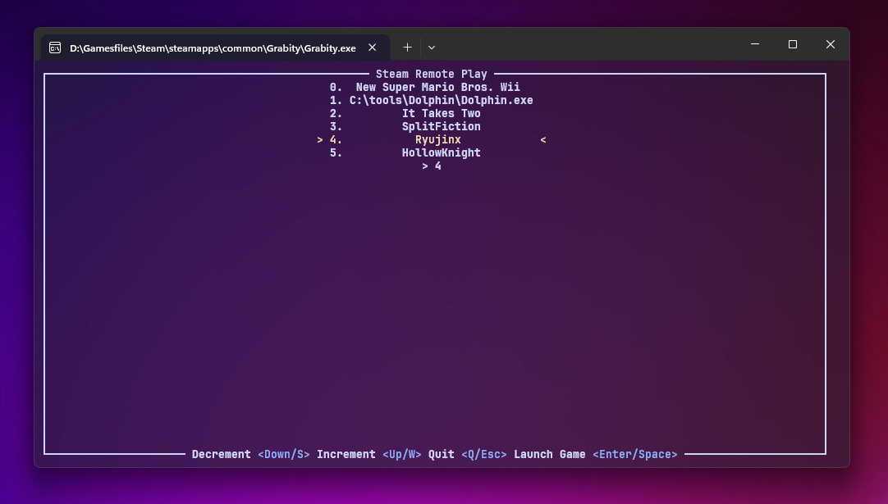
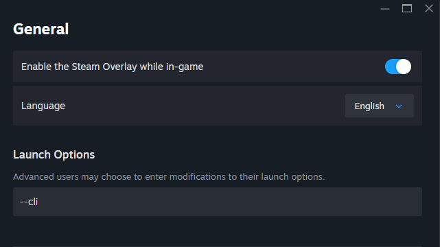
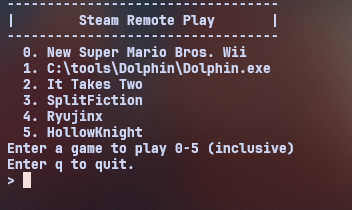
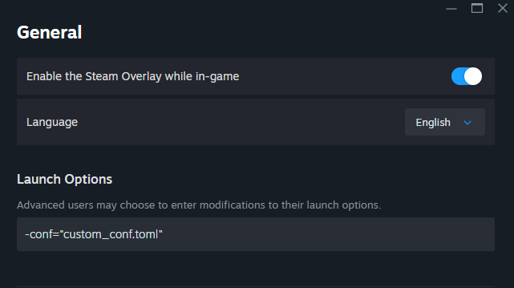

# Remote Play For Non Steam Games (RPFNSTG)
An application that allows users to utilize steam's remote play feature with non-steam games.
### Preview:

<div align="center">
    
    
</div>

### Requirements:
- Windows:
    - Windows Terminal (Installed by default on windows 11)
- Linux:
    - no support on linux because I haven't quite figured out how to get it working on that platform. Task for another time.
    - Linux launches games a bit differently than windows does, with some changed environment variables and what not that I haven't been keen on figuring out.
- Mac:
    - no support on mac because uhhh... yes....

## Quick Setup Guide:
1. Compile this application or download the the precompiled binary in the [release](./releases) section.
2. Download any steam game that supports remoteplay together. This game will provide the remote play functionality for this program.
    - I recommend [Retroarch](https://store.steampowered.com/app/1118310/RetroArch/), [Crashphalt](https://store.steampowered.com/app/921700/Crashphalt/), or [Grabity](https://store.steampowered.com/app/652810/Grabity/). 
3. Go into the game's directory: Right-click → Properties → Installed Files → Browse
4. Find the game's main executable. For example: `crashphalt.exe`. Delete the game's original executable (.exe) file and replace it with this application's executable. Be sure to rename this application's executable to what the game's executable was.
5. Create a `games.toml` or `games.txt` file next to this application's executable.. Fill your `games.toml` or `games.txt` with information about the executable of the non steam game you want to be remote-playable. In the case where both of these files exist, the application will use the `.toml` file.
6. Launch the original steam game that we replaced the executable for.
7. In the ui, select the game you want to remote play and hit `enter`
8. After the selected game launches, you may invite your friends to remote play with you.

### Example of `games.toml`
- you may also refer to the example format in the [examples folder](./examples/example.toml)
- remember that `#` are comments in `.toml`
- path is the only field that is necessary. Note that the name field is just so the ui can display a game name instead of a path to an executable.
- Note that you can technically inject custom environment variables with `env_variables` with the toml conf, although there isn't really a purpose of this (as of now).
```toml
[[game]]
path = '/home/user/.local/share/games/executable'
arguments = ['--custom', '--game', '--flags']
name = 'Custom Game Name' 

[[game]]
# This is completely okay!
path = 'C:\path\to\executable.exe'
```

### Example of `games.txt`
- I would recommend using this format for the less tech-savvy
- format is `PATH_TO_EXECUTABLE` | `OPTIONAL NAME`
- you may also refer to the example format in the [examples folder](./examples/example.txt)
- Please add quotations "" around your path and arguments if they contain spaces.
- you may also game specific launch arguments after the executable, as if you were launching it from the terminal yourself
- This format is simpler as you can just paste the paths of each executable each line
- This format does not support environment variables
```
"C:\Users\user\scoop\apps\ryujinx\current\Ryujinx.exe"
# lines that start with a # are ignored
C:\tools\Dolphin\Dolphin.exe" -b -e "D:\Games\New Super Mario Bros. Wii (USA) (En,Fr,Es) (Rev 2).wbfs" | New Super Mario Bros. Wii
```


## Additional features
- You may also use the `cli` interface instead of the default `tui` by adding `--cli` in the properties tab.






- You may give it a custom conf file that takes priority over the two default conf files the application reads. You may add that by adding `-conf="CUSTOM_CONF_NAME.toml"`. It will determine which format to use if the file is suffixed with `.toml`.
- Please wrap your custom file name in quotes & ensure the path is relative to the location of the executable. 



# Compiling
- Ensure you have rust toolchain installed
- The compiled binary will be in `.\target\debug\remote-play.exe` or `.\target\release\remote-play.exe`.
```bash
cargo build

# build release
cargo build --release

# run with cargo 
cargo run
```
